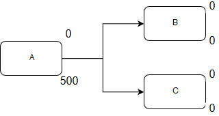
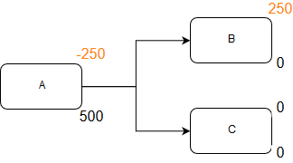
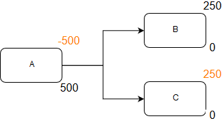
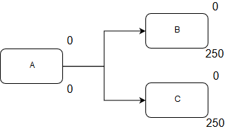

###############
Modifying Value
###############

Staging
=======

In order to correctly perform operations, it is necessary to introduce 'staging'.

This is best highlighted with the following case. Let's say we want to distribute
a person's lottery winnings (1000) to two banks, 50% of the winnings to each bank.

We can represent this case in the diagram below, where the subscript indicates the 
value of a node at the current discrete event.

.. figure:: _imgs/example_unstaged.png
    :scale: 50%

To distribute the money, we need to execute the following (pseudo) code:

.. code-block:: bash
    
    send 0.50 of Salary from Salary to A
    send 0.50 of Salary from Salary to B

Clearly, if we follow these steps one-by-one we will have an issue.
After evalauting the first line, the remaining value left in the Salary node
will cause the next line of code to be incorrect.

After transferring 50% of the value from the Salary node (500) to A, there is only
500 left in the Salary node. We then perform a similar operation but destined to B,
this only transfers 250 (0.50 * 500) - which is not what we want.

To prevent this, we introduce staging. Staging ensures that the value of an element
is not modified until the end of a discrete time step (or event). I.e., we attempt
to make atomic operations on the value of elements

Another example, similar to before, we have one node that has value, and we want to
equally distribute its net holding to two other nodes. Notice we introduce the superscript
to reflect this temporary staging value

