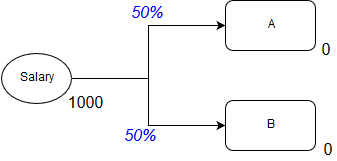

###############
Modifying Value
###############

Staging
=======

In order to correctly perform operations, it is necessary to introduce 'staging'.

This is best highlighted with the following case. Let's say we want to distribute
a person's lottery winnings (1000) to two banks, 50% of the winnings to each bank.

We can represent this case in the diagram below, where the subscript indicates the 
value of a node at the current discrete event.

